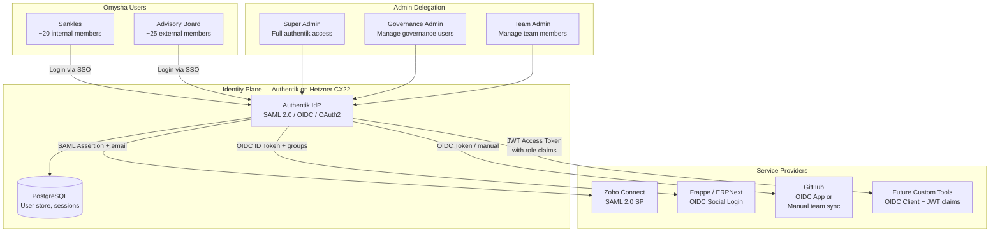
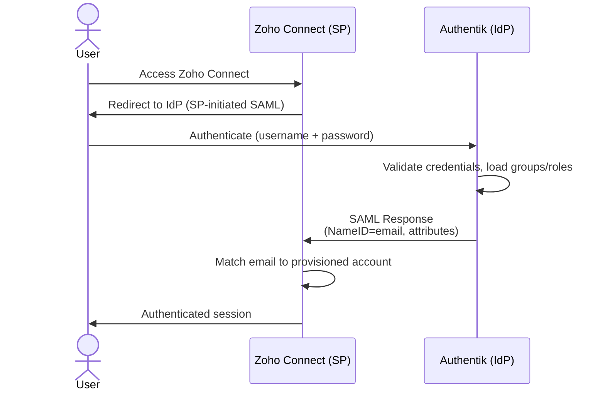
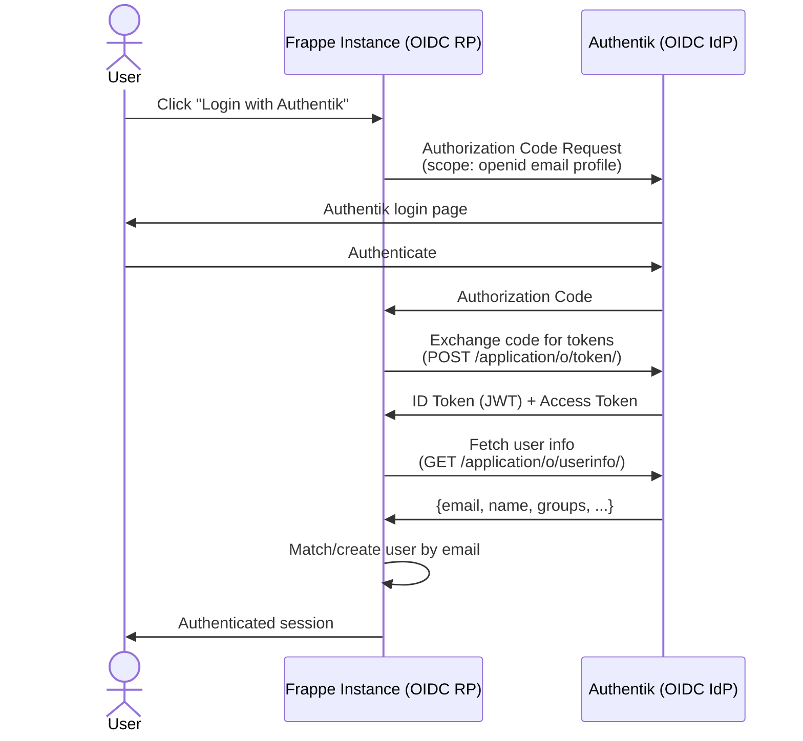
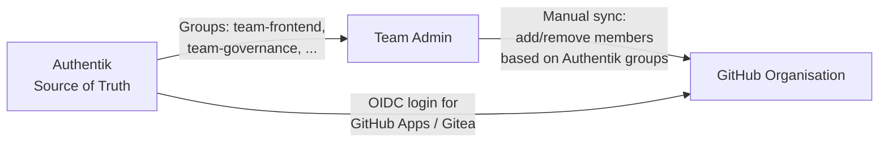
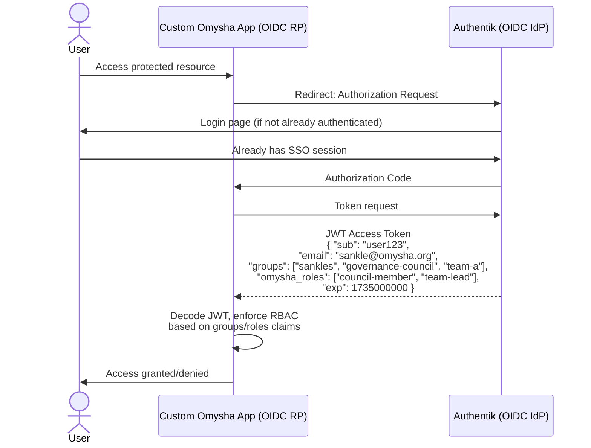
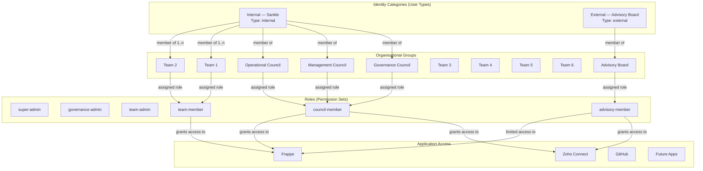
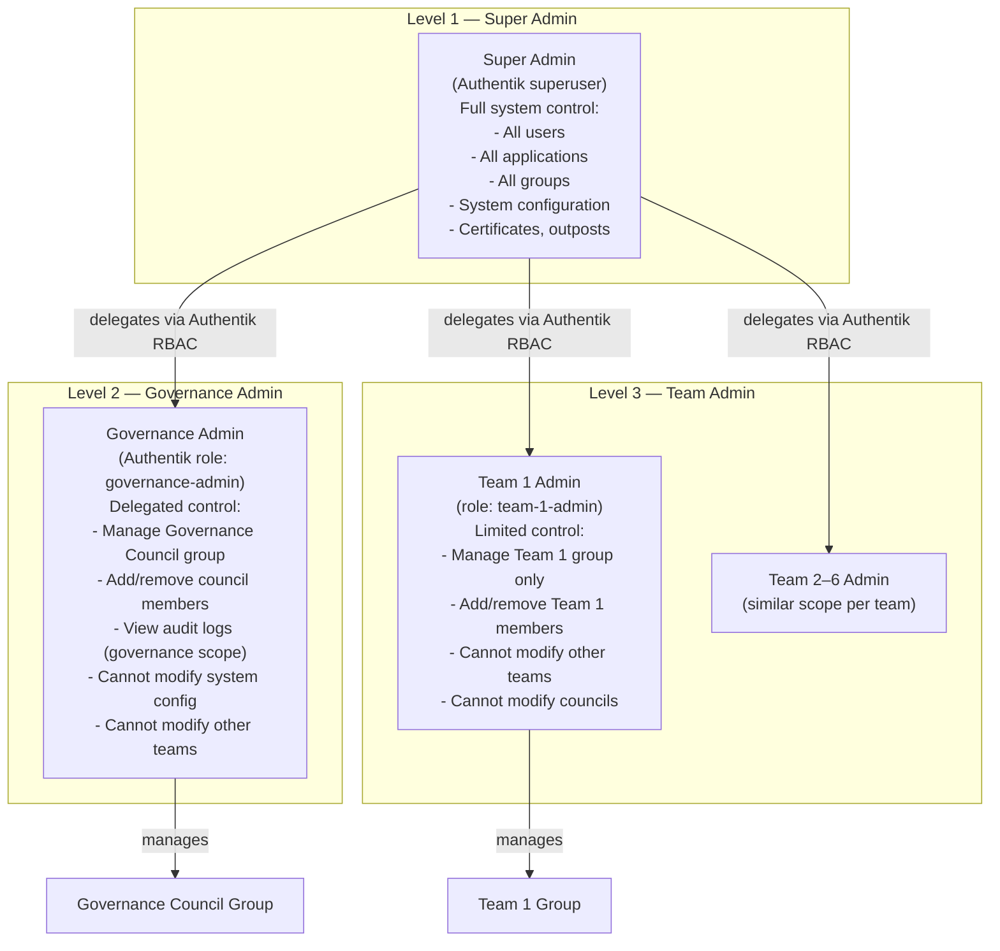
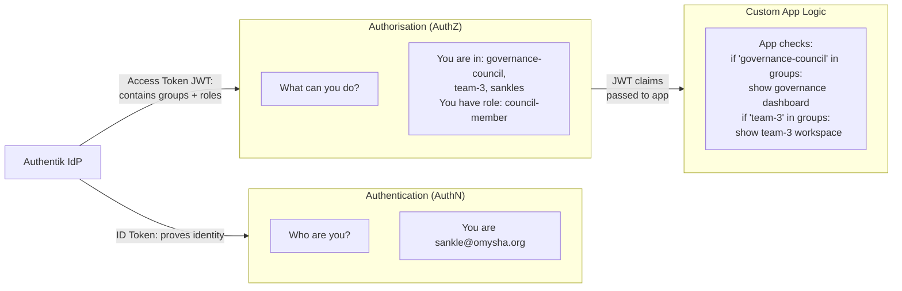
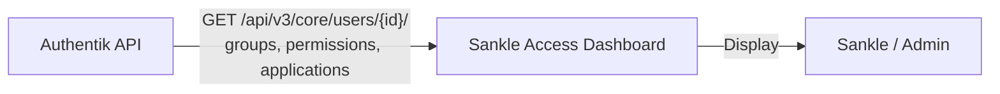

# Centralised Identity and Access Management for Omysha
## Architect's Recommendation Report — v2.0
**Prepared:** March 2026
**Classification:** Internal Strategic Document
**Audience:** Leadership, Governance Council, Technical Stakeholders

---

## Table of Contents

1. [Executive Summary](#1-executive-summary)
2. [Organisational Context and Requirements](#2-organisational-context-and-requirements)
3. [Candidate Evaluation](#3-candidate-evaluation)
   - [3.1 Authentik](#31-authentik)
   - [3.2 Keycloak](#32-keycloak)
   - [3.3 ZITADEL](#33-zitadel)
   - [3.4 Eliminated Candidates](#34-eliminated-candidates)
4. [Comparison Matrix](#4-comparison-matrix)
5. [Top Recommendation: Authentik](#5-top-recommendation-authentik)
6. [High-Level Architecture](#6-high-level-architecture)
7. [SSO Integration Details](#7-sso-integration-details)
   - [7.1 Zoho Connect](#71-zoho-connect)
   - [7.2 Frappe (Self-Hosted)](#72-frappe-self-hosted)
   - [7.3 GitHub](#73-github)
   - [7.4 Future Custom Systems](#74-future-custom-systems)
8. [Role and Identity Hierarchy Model](#8-role-and-identity-hierarchy-model)
9. [Admin Delegation Model](#9-admin-delegation-model)
10. [Centralised Authorisation via JWT Token Claims](#10-centralised-authorisation-via-jwt-token-claims)
11. [Hosting and Cost Analysis](#11-hosting-and-cost-analysis)
12. [Scalability and Future Vision](#12-scalability-and-future-vision)
13. [Risks and Limitations](#13-risks-and-limitations)
14. [Implementation Roadmap](#14-implementation-roadmap)
15. [References](#15-references)

---

## 1. Executive Summary

Omysha requires a single, trusted identity system that can authenticate and authorise approximately 45 people (20 Sankles + 25 Advisory Board members) across Zoho Connect, a self-hosted Frappe instance, GitHub, and future custom-built tools — all within a hard infrastructure budget of USD $10 per month.

After evaluating Keycloak, Authentik, ZITADEL, Kanidm, and the lldap+Authelia combination, this document recommends **Authentik** as the primary Identity Provider (IdP).

**Key conclusions:**

- **Authentik** is the strongest fit: it is open-source with no per-user fees, supports SAML 2.0 and OIDC natively, has a documented working integration with Zoho, Frappe, and GitHub Enterprise Server, supports multi-role assignment per user through groups, and can run comfortably on a Hetzner CX22 VPS (~EUR 3.79/month, ~USD 4.15) within budget.
- Authentik's **RBAC model** (roles → groups → users) maps cleanly onto Omysha's governance structure: councils, teams, Sankles, and Advisory Board members can each be a group, with roles stacked per person.
- Authentik's **OIDC JWT tokens** include group/role claims that future custom systems can consume directly for authorisation, providing a path to centralised authorisation — not just authentication.
- The **GitHub SAML SSO caveat** applies to all candidates: GitHub's native SAML SSO for organisations requires GitHub Enterprise Cloud (paid). A practical, cost-free workaround is documented in Section 7.3.
- The **admin delegation model** (Super Admin → Governance Admin → Team Admin) is achievable in Authentik through its RBAC permission system and role delegation.

---

## 2. Organisational Context and Requirements

### 2.1 Omysha's Structure

| Entity | Count | Notes |
|---|---|---|
| Sankles (internal members) | ~20 | Full members with org-wide access |
| Advisory Board members | ~25 | External collaborators, logically separated |
| Governance Council | Subset | Top-level authority |
| Management Council | Subset | Operational management |
| Operational Council | Subset | Day-to-day operations |
| Functional Teams | 6 | Each with specific tool access |

People hold **multiple roles simultaneously** (e.g., a Sankle may be on the Governance Council and lead Team A). The identity system must support this natively.

### 2.2 Current and Future Toolchain

```
Current:    Zoho Connect  |  Frappe (self-hosted)  |  GitHub
Future:     Google Workspace (possible)  |  Custom-built internal tools
```

### 2.3 Hard Constraints

| Constraint | Requirement |
|---|---|
| Total monthly cost | ≤ USD $10 (infra + licensing combined) |
| SSO | Mandatory |
| RBAC with multi-role per person | Mandatory |
| Integration with Zoho, Frappe, GitHub | Mandatory |
| Multi-level admin delegation | Mandatory (Super Admin > Governance Admin > Team Admin) |
| External/internal member separation | Required |
| MFA | Not mandatory at this stage |
| Periodic access reviews | Not required at this stage |
| Self-hosted or affordably hosted | Required |

---

## 3. Candidate Evaluation

### 3.1 Authentik

**Project:** [goauthentik/authentik](https://github.com/goauthentik/authentik)
**Licence:** MIT (open-source core), Enterprise tier optional
**Language:** Python (backend), TypeScript (frontend)
**Community:** 20,200+ GitHub stars (as of early 2026), bimonthly release cadence
**Commercial backing:** Authentik Security Inc. (public benefit company)

#### Protocol Support

| Protocol | Support |
|---|---|
| SAML 2.0 (IdP) | Full — SP-initiated and IdP-initiated |
| OIDC / OAuth2 | Full — access tokens, ID tokens, refresh tokens |
| LDAP (read) | Via LDAP outpost |
| SCIM | Supported for provisioning |

#### RBAC and Multi-Role Support

Authentik's access control model is built on a three-layer hierarchy:

```
Permissions  →  Roles  →  Groups  →  Users
```

- A **Role** is a named collection of permissions.
- **Groups** can be assigned one or more Roles.
- **Users** can belong to multiple Groups simultaneously, and directly receive multiple Roles.
- Roles and permissions are **inherited through the group tree** (child groups inherit from parent groups).

A user like a Sankle who is also a Governance Council member and Team A Lead can be a member of three groups simultaneously, inheriting all corresponding roles and permissions. This is a first-class feature, not a workaround.

Since release 2025.12, Authentik introduced a full RBAC overhaul with multi-parent groups and role-inherited permissions, significantly strengthening this model. [[Release 2025.12](https://docs.goauthentik.io/releases/2025.12)]

#### Admin Delegation

Authentik's RBAC provides the ability to finely configure permissions within authentik itself, allowing delegation of tasks — such as user management, application creation, group management — to specific users without granting full superuser permissions. [[Permissions docs](https://docs.goauthentik.io/users-sources/access-control/permissions/)]

This maps directly to Omysha's three-tier admin model:
- **Super Admin**: Full authentik admin (manages the whole instance, all applications, all users)
- **Governance Admin**: Assigned a role with permissions to manage specific groups/users/applications scoped to the Governance domain
- **Team Admin**: Assigned a role with permissions limited to their team's group membership

#### Internal vs External User Separation

Authentik supports distinct user types:
- **Internal users**: Sankles — full access to the user dashboard and all authorised applications
- **External users**: Advisory Board members — redirected to a configured default application; cannot access the admin or user dashboard unless explicitly permitted

Advisory Board members can be placed in a dedicated group (`advisory-board`) with access restricted only to specific applications (e.g., a shared Frappe workspace), while Sankles have broader access. This is configurable without any enterprise licence.

#### JWT Token Claims for Downstream Authorisation

Authentik's OAuth2/OIDC provider supports configurable **Scope Mappings** (a type of Property Mapping written in Python). By default, the `profile` scope includes the user's group membership in the token. Custom scope mappings can add any attribute — including role names, council membership, team names, or custom user attributes — to the JWT access token or ID token.

Downstream custom systems (future Omysha tools) can decode these tokens and enforce authorisation locally based on the claims, without calling back to the IdP on each request. [[OAuth2 provider docs](https://docs.goauthentik.io/add-secure-apps/providers/oauth2/)]

#### Resource Requirements

Since Authentik 2025.10, Redis has been removed as a dependency. The stack is now:
- Authentik server process
- Authentik worker process
- PostgreSQL database

Idle RAM usage for a small deployment (~10 users, ~5 applications): approximately 735 MB total (server + worker combined). Recommended minimum for production: 2 vCPU, 2 GB RAM. [[Resource discussion](https://github.com/goauthentik/authentik/discussions/9569)]

On a Hetzner CX22 (2 vCPU, 4 GB RAM, EUR 3.79/month), Authentik runs with comfortable headroom.

#### Known Limitations

- **Zoho IdP-initiated login** does not work due to Zoho's non-standard NameID format requirement. SP-initiated login (user clicks "Login with SSO" on Zoho) works correctly. [[Authentik Zoho integration](https://integrations.goauthentik.io/platforms/zoho/)]
- GitHub SAML SSO requires GitHub Enterprise Cloud (a constraint affecting all candidates, not specific to Authentik).
- Accounts must be **manually provisioned** in Zoho before SSO can be used (Zoho does not support automated SCIM provisioning from all IdPs at the free tier).
- Python-based backend is slightly heavier than Go-based alternatives; however, the Redis removal in 2025.10 simplified the operational footprint significantly.

---

### 3.2 Keycloak

**Project:** [keycloak/keycloak](https://github.com/keycloak/keycloak)
**Licence:** Apache 2.0
**Language:** Java (Quarkus)
**Commercial backing:** Red Hat / IBM
**Community:** Largest in the category — 25,000+ GitHub stars, extensive documentation

#### Protocol Support

Full SAML 2.0, OIDC, OAuth2, LDAP, Kerberos, SCIM. The most complete protocol coverage of all candidates.

#### RBAC and Multi-Role Support

Keycloak has two layers of roles:
- **Realm Roles**: Global within a Keycloak realm, applicable across all clients
- **Client Roles**: Scoped to a specific application (client)
- **Composite Roles**: A role that inherits from other roles (role hierarchy)

A user can be assigned any number of realm roles and client roles simultaneously. Role claims are included in the JWT access token automatically via the `realm_access` and `resource_access` standard claims.

Keycloak also supports **Groups** which can have roles assigned, allowing role inheritance via group membership.

#### Admin Delegation

Keycloak's **Fine-Grained Admin Permissions V2** (released in Keycloak 26.2) provides delegated administration — server admins can assign management privileges to users in a realm. [[Fine-grained admin permissions](https://www.keycloak.org/2025/05/fgap-kc-26-2)]

The master realm holds the top-level admin. Each realm client can have delegated admins. This maps to Omysha's three-tier model but requires careful Keycloak realm design.

#### Resource Requirements

Keycloak is **Java-based** and resource-hungry. Red Hat's own sizing guide recommends:
- Base memory: **1,250 MB RAM** for a single node with 10,000 cached sessions
- Minimum practical: 750 MB heap + 300 MB non-heap = ~1,050 MB minimum
- Recommended for stability: **2 GB RAM minimum**, ideally 4 GB

Recent versions (v24+) have seen reports of increased memory consumption compared to v23. [[Keycloak sizing guide](https://www.keycloak.org/high-availability/concepts-memory-and-cpu-sizing)] [[Memory increase issue](https://github.com/keycloak/keycloak/issues/28211)]

On a Hetzner CX22 (4 GB RAM), Keycloak fits — but with less headroom than Authentik, particularly if the same host also runs PostgreSQL.

#### Assessment for Omysha

Keycloak is battle-tested and protocol-complete, but it is operationally heavier. Its configuration model (realms, clients, mappers, flows) has a significantly steeper learning curve. For a ~45-person organisation without a dedicated IAM engineer, it introduces unnecessary operational burden. The fine-grained admin delegation in v26.2+ is powerful but complex to configure correctly.

---

### 3.3 ZITADEL

**Project:** [zitadel/zitadel](https://github.com/zitadel/zitadel)
**Licence:** AGPL 3.0 (switched from Apache 2.0 in v3)
**Language:** Go
**Commercial:** ZITADEL Cloud free tier (with limits), self-hosted free

#### Protocol Support

SAML 2.0, OIDC, OAuth2. No native LDAP server (can consume LDAP sources). Strong API-first design with gRPC and REST APIs.

#### RBAC and Multi-Role Support

ZITADEL provides RBAC but explicitly documents that "ZITADEL provides RBAC but no permission handling" — meaning the IdP emits role claims but the enforcement of what those roles *permit* must happen in the consuming application. [[RBAC discussion](https://github.com/zitadel/zitadel/discussions/9768)]

Users can be assigned to multiple roles within a project. The **Manager** hierarchy is ZITADEL's internal admin delegation model:
- IAM Manager (instance-wide)
- Org Manager (organisation-wide)
- Project Manager (project-scoped)
- Project Grant Manager (for granted projects)

[[ZITADEL Managers](https://zitadel.com/docs/concepts/structure/managers)] (404 at time of research — see [ZITADEL docs overview](https://zitadel.com/docs))

#### Resource Requirements

ZITADEL is a Go binary — very lightweight. Can run with **512 MB RAM** in test environments. Production recommendation: 1-2 GB RAM with PostgreSQL. ZITADEL v3 requires PostgreSQL 14–18 (CockroachDB support dropped). [[Requirements](https://zitadel.com/docs/self-hosting/manage/requirements)]

#### Assessment for Omysha

ZITADEL is architecturally modern and lightweight, but its RBAC model places more responsibility on consuming applications to enforce permissions. Its multi-tenancy (Organisations model) is powerful for B2B SaaS but adds complexity for a single-organisation governance setup. The AGPL 3.0 licence switch in v3 introduces a copyleft consideration for future custom systems. The community is smaller than Keycloak or Authentik. The Zoho SAML integration is not officially documented by ZITADEL (unlike Authentik's dedicated Zoho guide).

---

### 3.4 Eliminated Candidates

#### lldap + Authelia

**lldap** is a lightweight LDAP server with a web UI for basic user and group management. It does **not** provide SAML 2.0 or OIDC natively — it requires a separate portal like Authelia or Keycloak. **Authelia** is primarily a forward-authentication proxy for reverse-proxy setups (e.g., NGINX, Traefik) and does not function as a full IdP. The combination cannot natively issue SAML assertions to Zoho. Eliminated due to architectural gap. [[lldap](https://github.com/lldap/lldap)] [[Authelia](https://www.authelia.com/)]

#### Kanidm

Kanidm is a Rust-based, security-first IAM system with strong Unix integration. Its web UI is primarily user-facing; administration is primarily CLI-based. OAuth2/OIDC support is present but SAML 2.0 support is limited/absent. The community is significantly smaller than Authentik or Keycloak. Eliminated due to insufficient SAML support for Zoho integration and limited operational tooling. [[Kanidm](https://github.com/kanidm/kanidm)]

#### Okta, Auth0, Azure AD, Ping Identity

Explicitly out of scope per requirements (enterprise/expensive options). Free tiers on Auth0 (25,000 MAU free) are tempting but vendor lock-in risk and the fact that the free tier excludes SAML (requires paid plan) makes them non-viable.

---

## 4. Comparison Matrix

| Criterion | Authentik | Keycloak | ZITADEL |
|---|---|---|---|
| **Licence** | MIT (OSS core) | Apache 2.0 | AGPL 3.0 (v3+) |
| **SAML 2.0** | Full | Full | Full |
| **OIDC / OAuth2** | Full | Full | Full |
| **RBAC + Multi-Role** | Strong (groups + roles) | Strong (realm + client roles) | Moderate (roles without enforcement) |
| **Admin Delegation** | Strong (RBAC-based delegation) | Strong (fine-grained v26.2+) | Moderate (Manager hierarchy) |
| **Zoho SAML** | Documented, SP-init works | Works (community reports) | No official guide |
| **Frappe OIDC** | Official guide exists | Community-supported | No official guide |
| **GitHub SSO** | Via Enterprise Server plugin | Via Enterprise Server plugin | Via Enterprise Server plugin |
| **JWT Role Claims** | Custom scope mappings (Python) | Protocol mappers (config-driven) | Roles in token claims |
| **Internal/External User Separation** | Native (user types) | Via groups/attributes | Via organisations |
| **Min RAM (production)** | ~2 GB (Redis removed 2025.10) | ~2 GB (Java overhead) | ~1 GB (Go binary) |
| **Operational Complexity** | Moderate | High | Moderate |
| **Community Size** | Large (20k+ stars) | Very Large (25k+ stars) | Medium (12k+ stars) |
| **Release Cadence** | Bimonthly (active) | Frequent (active) | Regular (active) |
| **Hetzner CX22 fit** | Excellent (4 GB RAM) | Good (tight with DB) | Excellent |
| **Monthly Cost (hosting)** | ~$4.15 (Hetzner CX22) | ~$4.15 (Hetzner CX22) | ~$4.15 (Hetzner CX22) |
| **Zoho IdP-init login** | Does not work | Works | Not documented |
| **Self-host deployment** | Docker Compose | Docker Compose | Docker Compose |

---

## 5. Top Recommendation: Authentik

**Recommended solution: self-hosted Authentik on a Hetzner CX22 VPS**

### Justification

1. **Protocol completeness meets all integration requirements.** Authentik supports SAML 2.0 (for Zoho), OIDC/OAuth2 (for Frappe and future systems), and has a documented integration path for GitHub Enterprise Server.

2. **The Zoho integration is officially documented and tested.** Authentik's integration catalogue includes a dedicated [Zoho guide](https://integrations.goauthentik.io/platforms/zoho/) with step-by-step instructions. The SP-initiated flow (the standard enterprise usage pattern) works reliably. The only limitation — IdP-initiated login — is a Zoho-side constraint, not an Authentik deficiency, and affects all self-hosted IdPs equally.

3. **RBAC with multi-role per person is a first-class citizen.** The groups → roles → permissions model directly supports Omysha's governance structure without workarounds. A Sankle can simultaneously be a Governance Council member, a Team Lead, and an Advisory Committee liaison, with all corresponding permissions active.

4. **Admin delegation is configurable without enterprise licensing.** Authentik's RBAC permission system allows creating a "Governance Admin" role that grants user management permissions scoped to the Governance Council group, and a "Team Admin" role scoped further. No enterprise licence is needed.

5. **Internal/external user separation is native.** Advisory Board members can be created as "external" user type — they can authenticate and access designated applications but cannot see Sankle-only applications or the admin panel.

6. **The operational footprint is manageable.** Since 2025.10, the Redis dependency has been removed. The deployment is PostgreSQL + two Authentik processes. Docker Compose deployment is straightforward and well-documented.

7. **Zero licensing cost.** The open-source core has no per-user fee and no feature gates that matter to Omysha's use case.

8. **Future-proof token-based authorisation.** Custom scope mappings allow embedding council membership, team roles, and any custom attributes into JWT tokens. Future custom-built Omysha tools can consume these claims directly.

9. **Financially sustainable.** Authentik Security Inc. (the commercial entity behind the project) has adopted an open-core model that explicitly commits to not moving open-source features to enterprise tier. The frequent release cadence and active community reduce abandonment risk.

---

## 6. High-Level Architecture

The architecture places Authentik as the single authoritative identity plane. All authentication flows pass through it. Role and group data originates in Authentik and propagates to connected systems via SSO tokens or protocol assertions.



### Architecture Principles

- **Authentik is the single source of truth** for user identities, group memberships, and role assignments.
- **No passwords are stored in Zoho, Frappe, or GitHub** for SSO-enabled users; credentials live only in Authentik.
- **Role claims flow outward** via OIDC token claims and SAML attribute assertions.
- **Admin delegation is layered**: Governance Admin cannot exceed the permissions of Super Admin; Team Admin cannot exceed the permissions of Governance Admin.

---

## 7. SSO Integration Details

### 7.1 Zoho Connect



**Protocol:** SAML 2.0 (Zoho does not support OIDC as an IdP consumer)

**Configuration Steps:**

1. In Zoho Accounts: navigate to **Organisation → SAML Authentication**, download Zoho's metadata XML.
2. In Authentik Admin: create a **SAML Provider** using Zoho's metadata. Set:
   - Signing Certificate: select a certificate
   - NameID Property Mapping: `authentik default SAML Mapping: Email`
3. Create an **Application** in Authentik linked to this provider. Set launch URL to `https://www.zoho.com/login.html`.
4. Download Authentik's metadata XML from the provider's **Related Objects → Metadata** section.
5. In Zoho: upload Authentik's metadata. Set Name Identifier to `Email Address`. Submit.
6. **Pre-provision users** in Zoho with matching email addresses before first SSO login.

**Reference:** [Authentik Zoho Integration Guide](https://integrations.goauthentik.io/platforms/zoho/) | [Zoho SAML Configuration](https://help.zoho.com/portal/en/kb/accounts/manage-your-organization/saml/articles/configure-saml-in-zoho-accounts)

**Known Limitation:** IdP-initiated login does not work (Zoho restriction on NameID format). All logins must be initiated from Zoho's login page. This is standard enterprise behaviour and not an impediment to daily use.

**Advisory Board access:** Assign Advisory Board members to the `zoho-connect-access` group in Authentik, and bind this group to the Zoho application. Members not in this group cannot access Zoho even if they have an Authentik account.

---

### 7.2 Frappe (Self-Hosted)



**Protocol:** OIDC / OAuth2 (Authorization Code Flow)

**Configuration Steps:**

**In Authentik:**
1. Create an **OAuth2/OpenID Connect Provider**. Record the `Client ID`, `Client Secret`, and `slug`.
2. Set Redirect URI: `https://frappe.yourdomain.com/api/method/frappe.integrations.oauth2_logins.custom/<provider-name>`
3. Set Subject Mode: `Based on the User's username`
4. Add a scope mapping to include groups: select `authentik default OAuth Mapping: OpenID 'profile'` and add a custom scope mapping returning `{"groups": [group.name for group in request.user.ak_groups.all()]}` if role-based Frappe profiles are needed.

**In Frappe:**
1. Go to **Integrations → Social Login Key → New**.
2. Enable Social Login toggle.
3. Enter `Client ID` and `Client Secret`.
4. Set `Base URL`: `https://authentik.yourdomain.com/`
5. Configure endpoints:
   - Authorize: `/application/o/authorize/`
   - Access Token: `/application/o/token/`
   - API Endpoint: `/application/o/userinfo/`
6. Auth Scope: `{ "response_type": "code", "scope": "email profile openid" }`
7. Allow sign-ups: On. Save.

**Reference:** [Authentik Frappe Integration Guide](https://integrations.goauthentik.io/development/frappe/) | [Frappe OIDC Docs](https://docs.frappe.io/framework/user/en/guides/integration/openid_connect_and_frappe_social_login)

**Role Mapping in Frappe:** The community-maintained [frappe-oidc-extended](https://github.com/MohammedNoureldin/frappe-oidc-extended) extension enables mapping JWT group claims to Frappe roles, allowing Authentik groups to directly control Frappe role assignments.

**Advisory Board access:** Advisory Board members can be assigned a Frappe role (e.g., `Advisory Board Member`) via their Authentik group claim, limiting them to relevant Frappe modules.

---

### 7.3 GitHub

**Important constraint:** GitHub's native SAML SSO for organisations requires **GitHub Enterprise Cloud** (approximately USD $21/user/month). This constraint applies to all IdP candidates — it is a GitHub platform restriction, not an Authentik limitation. [[GitHub SAML SSO docs](https://docs.github.com/en/enterprise-cloud@latest/organizations/managing-saml-single-sign-on-for-your-organization/about-identity-and-access-management-with-saml-single-sign-on)]

**Recommended approach for Omysha (cost-free):**

Since Omysha uses GitHub at the free or Teams tier, the practical strategy is a **hybrid model**:



**Option A — Manual Sync (recommended for current scale):**
- Authentik is the authoritative source for group membership.
- A Team Admin refers to Authentik group membership when adding/removing members from GitHub teams.
- At ~45 people, this is low-effort (changes are infrequent).
- Authentik group reports or a simple API query (`GET /api/v3/core/groups/`) can be used to audit membership.

**Option B — GitHub App + OIDC (for authentication only):**
- Register Authentik as an OAuth2/OIDC app within GitHub (for services or automation accounts).
- GitHub users still authenticate with their own GitHub credentials to github.com, but service-to-service authentication can flow through Authentik.

**Option C — If GitHub Enterprise is adopted in future:**
- All candidates (Authentik, Keycloak, ZITADEL) support SAML for GitHub Enterprise. The integration follows standard GitHub SAML setup with Authentik as the IdP.
- GitHub team synchronisation with IdP groups would then allow automatic team membership management. [[GitHub team synchronisation](https://docs.github.com/en/enterprise-cloud@latest/organizations/managing-saml-single-sign-on-for-your-organization/managing-team-synchronization-for-your-organization)]

---

### 7.4 Future Custom Systems



**Integration pattern:** Any custom system built by Omysha registers as an **OIDC Relying Party (RP)** in Authentik. The application:
1. Redirects unauthenticated users to Authentik's authorisation endpoint.
2. Exchanges the authorisation code for tokens.
3. Reads the `groups` and custom role claims from the JWT.
4. Enforces application-specific permissions locally based on those claims.

Because Authentik signs JWTs with a private key, applications can verify token authenticity without calling back to Authentik on every request — the token is a self-contained credential valid for its lifetime (configurable, typically 5–60 minutes).

**Custom scope mapping example** (to be added in Authentik Customization → Property Mappings → Scope Mapping):

```python
# Returns Omysha-specific role claims
return {
    "omysha_roles": [group.name for group in request.user.ak_groups.all()],
    "is_sankle": request.user.type == "internal",
    "council_membership": [
        g.name for g in request.user.ak_groups.all()
        if "council" in g.name.lower()
    ]
}
```

This scope mapping is attached to the OIDC provider for each custom application.

---

## 8. Role and Identity Hierarchy Model



**Key design decisions:**

1. **A person is represented as one Authentik user account** regardless of how many roles or councils they belong to. Multiple group memberships handle multi-role assignment.

2. **Groups are additive.** A Sankle who is a Governance Council member and Team 3 Lead has the union of all permissions from all their groups.

3. **Advisory Board members are a separate group** (`advisory-board`) with the `advisory-member` role. This role grants access only to designated applications. They cannot see applications bound exclusively to the `sankles` group.

4. **Application bindings in Authentik** control which groups can access which applications. Access is denied by default; groups are explicitly granted access to each application.

5. **Token claims reflect actual group membership.** When an Advisory Board member authenticates to Frappe, their JWT includes `"groups": ["advisory-board"]`, not any council or team groups.

---

## 9. Admin Delegation Model



**Implementation in Authentik:**

The admin delegation is implemented using Authentik's **object-level permissions** system:

1. **Create a role** named `governance-admin` with the following global permissions:
   - `Can view User`
   - `Can change Group Membership` (scoped to governance groups only via object permission)

2. **Create object-level permissions** on the Governance Council group, granting the `governance-admin` role the ability to edit that specific group's membership.

3. **Assign the `governance-admin` role** to the designated Governance Admin user.

4. **Repeat the pattern** for each Team Admin, scoping their object-level permissions to their respective team group only.

This means a Team Admin for Team 3 literally cannot see or modify Team 4's members in the Authentik UI — they only see the objects they have permissions on.

**Escalation principle:** No delegated admin can grant permissions they do not themselves possess. A Governance Admin cannot create a new Super Admin. Authentik enforces this at the permission-checking layer.

---

## 10. Centralised Authorisation via JWT Token Claims

A key architectural question for future Omysha systems is: **can the IdP serve as the source of truth for authorisation (not just authentication)?**

The answer is **yes, with an important design distinction:**



**How it works in practice:**

Authentik issues JWT access tokens containing the user's group memberships and any custom role claims defined in scope mappings. These tokens are:
- **Cryptographically signed** (RSA or ECDSA, configurable) by Authentik's private key
- **Verifiable** by any application with access to Authentik's public JWKS endpoint (`/application/o/<app-slug>/jwks/`)
- **Self-contained** — no network call to Authentik is needed per request

A custom Omysha app (e.g., a governance dashboard) can:
1. Accept the JWT from the OIDC flow
2. Verify the signature against Authentik's JWKS
3. Read the `groups` claim: `["sankles", "governance-council", "team-3"]`
4. Enforce local RBAC: if `governance-council` is in groups, show the governance panel

**The important design distinction:** Authentik acts as the **source of truth for identity and group/role assignments**. The **enforcement** of what each role permits within a given application remains the application's responsibility. This is the industry-standard pattern (used by Okta, Azure AD, and all major IdPs) and is the correct separation of concerns.

**What this means for Omysha:**
- Future custom tools do **not** need their own user database or role system — they consume Authentik claims.
- Changing a Sankle's role (e.g., promoting them to Governance Council) happens **once** in Authentik; the change propagates to all connected applications on the next authentication.
- The "Sankle access dashboard" (future vision) is a natural consequence of this architecture: it reads the user's current Authentik groups and displays their access profile across all integrated systems.

---

## 11. Hosting and Cost Analysis

### Recommended Hosting: Hetzner Cloud CX22

| Parameter | Value |
|---|---|
| Provider | Hetzner Cloud ([hetzner.com/cloud](https://www.hetzner.com/cloud)) |
| Plan | CX22 (Shared CPU, Cost-Optimised) |
| vCPU | 2 |
| RAM | 4 GB |
| Storage | 40 GB NVMe SSD |
| Network | 20 TB included traffic |
| Price | EUR 3.79/month (~USD 4.15/month) |
| Location | Falkenstein, Nuremberg, or Helsinki (EU) |
| IPv4 included | Yes |
| DDoS protection | Included |

**Total monthly cost breakdown:**

| Item | Cost |
|---|---|
| Hetzner CX22 VPS | ~USD 4.15/month |
| Authentik (open-source) | USD 0 |
| PostgreSQL (on same VPS) | USD 0 |
| Domain (if needed for IdP) | ~USD 1.00/month (optional, use existing) |
| TLS certificate (Let's Encrypt) | USD 0 |
| **Total** | **~USD 4.15–5.15/month** |

This leaves USD 4.85–5.85/month of the USD $10 budget as headroom.

### Why Hetzner over DigitalOcean or Fly.io

| Provider | Comparable Plan | Price | Notes |
|---|---|---|---|
| Hetzner CX22 | 2 vCPU, 4 GB RAM, 40 GB | ~USD 4.15/mo | Best value, EU-based, traffic included |
| DigitalOcean Basic Droplet | 2 vCPU, 2 GB RAM, 50 GB | ~USD 18/mo | Higher cost for same RAM |
| Fly.io | Variable (usage-based) | ~USD 5–15/mo | No fixed pricing, complex for stateful DBs |

Note: Hetzner announced a price increase effective April 2026 due to DRAM/NAND cost increases. The CX22 may adjust slightly, but is expected to remain significantly below DigitalOcean's comparable tier.

### Docker Compose Deployment Stack

```yaml
# Simplified docker-compose.yml for Authentik on Hetzner CX22
services:
  postgresql:
    image: docker.io/library/postgres:16-alpine
    volumes:
      - database:/var/lib/postgresql/data
    environment:
      POSTGRES_PASSWORD: ${PG_PASS}
      POSTGRES_USER: authentik
      POSTGRES_DB: authentik

  server:
    image: ghcr.io/goauthentik/server:2025.12
    command: server
    environment:
      AUTHENTIK_REDIS__HOST: ""  # Redis removed in 2025.10
      AUTHENTIK_POSTGRESQL__HOST: postgresql
      AUTHENTIK_POSTGRESQL__USER: authentik
      AUTHENTIK_POSTGRESQL__PASSWORD: ${PG_PASS}
      AUTHENTIK_SECRET_KEY: ${AUTHENTIK_SECRET_KEY}
    ports:
      - "0.0.0.0:9000:9000"
      - "0.0.0.0:9443:9443"
    depends_on:
      - postgresql

  worker:
    image: ghcr.io/goauthentik/server:2025.12
    command: worker
    environment:
      AUTHENTIK_REDIS__HOST: ""
      AUTHENTIK_POSTGRESQL__HOST: postgresql
      AUTHENTIK_POSTGRESQL__PASSWORD: ${PG_PASS}
      AUTHENTIK_SECRET_KEY: ${AUTHENTIK_SECRET_KEY}
    depends_on:
      - postgresql

volumes:
  database:
```

**Reference:** [Authentik Docker Compose install](https://docs.goauthentik.io/install-config/install/docker-compose/)

---

## 12. Scalability and Future Vision

### Near-Term (Current State)

- ~45 users, 4 applications (Zoho Connect, Frappe, GitHub manual sync, future tools)
- Hetzner CX22 is more than sufficient
- Single-node Authentik with PostgreSQL is stable and low-maintenance

### Medium-Term (Growth to ~100 users, Google Workspace addition)

- Hetzner CX22 remains appropriate up to several hundred users
- Google Workspace supports SAML SSO via third-party IdP — Authentik can serve as the IdP for Workspace SSO, unifying the login experience [[Google Workspace SAML setup](https://support.google.com/a/answer/6087519)]
- SCIM provisioning (supported by Authentik) can automate user lifecycle management in Google Workspace

### Long-Term (Sankle Access Dashboard)

The "Sankle access dashboard" — a unified view of each member's current access across all systems — is architecturally straightforward once Authentik is the central IdP:



The Authentik REST API exposes all user data, group memberships, and bound applications. A lightweight web application can query this API (using a service account token with read-only permissions) and render a real-time access profile for any user. This requires no additional IdP infrastructure — it is a consumer application on top of Authentik's existing API.

### If Organisation Grows Beyond Single Node

If Omysha grows significantly (hundreds of users, high availability requirements):
- Authentik supports horizontal scaling: multiple server instances behind a load balancer sharing a common PostgreSQL database.
- PostgreSQL can be migrated to a managed service (e.g., Hetzner Managed Databases, starting ~EUR 15/month).
- The same Authentik configuration, applications, and role definitions remain unchanged — scale is an operational concern, not an architectural redesign.

---

## 13. Risks and Limitations

### 13.1 GitHub SSO Limitation

**Risk:** GitHub SAML/OIDC SSO for organisations requires GitHub Enterprise Cloud (~USD $21/user/month). For 20 Sankles, this would be USD $420/month — far exceeding budget.

**Mitigation:** The manual sync approach described in Section 7.3 is operationally adequate at current scale. A Team Admin maintains GitHub team membership based on Authentik group state. If Omysha later migrates to GitHub Enterprise, the Authentik SAML integration is a standard, documented configuration.

### 13.2 Zoho IdP-Initiated Login

**Risk:** Users cannot be pushed from Authentik to Zoho (IdP-initiated SAML). All logins must begin from Zoho's login page.

**Mitigation:** This is standard enterprise behaviour. Users bookmark or access Zoho directly; SSO redirects them to Authentik transparently. The limitation is a Zoho platform constraint on NameID format handling, not an Authentik deficiency.

### 13.3 Manual User Provisioning in Zoho

**Risk:** New users must be manually created in Zoho before SSO login works. Zoho's SCIM support requires Zoho Directory Plus (paid add-on).

**Mitigation:** At ~45 users with low churn, manual provisioning is a minor operational task (< 5 minutes per new member). Document a standard onboarding checklist: (1) Create Authentik account, (2) Create matching Zoho account with same email, (3) Assign Authentik groups.

### 13.4 Self-Hosting Operational Responsibility

**Risk:** A self-hosted IdP requires the hosting organisation to manage uptime, backups, security patches, and TLS renewal.

**Mitigation:**
- Use automated TLS with Let's Encrypt via Caddy or Certbot (no manual cert management).
- Set up automated PostgreSQL backups (Hetzner Snapshots or `pg_dump` to object storage).
- Subscribe to Authentik's security advisories (RSS or GitHub releases).
- Authentik releases bimonthly; minor version updates are low-risk and well-documented.
- Consider designating one technical Sankle as the "IAM Owner" with a clear runbook.

### 13.5 Authentik Idle Memory on Small VPS

**Risk:** Authentik requires ~735 MB RAM at idle. On a 2 GB VPS, this leaves limited headroom for PostgreSQL and OS.

**Mitigation:** The recommended Hetzner CX22 has 4 GB RAM, providing ~3.2 GB after OS overhead for Authentik + PostgreSQL. This is comfortable. Do not use a 1 GB VPS.

### 13.6 AGPL Licence (ZITADEL Note)

**Note for future consideration:** If Omysha later evaluates ZITADEL, its AGPL 3.0 licence (from v3+) requires that any modifications to ZITADEL itself be open-sourced. For organisations that *embed* ZITADEL (not modify it), AGPL does not impose obligations on their own proprietary code. Authentik's MIT licence imposes no such concern.

### 13.7 Advisory Board Email Inconsistencies

**Risk:** Advisory Board members may use personal email addresses that differ from any Zoho/Frappe provisioned accounts, causing SSO matching failures.

**Mitigation:** Enforce a single canonical email address per person at the point of Authentik account creation. Document this in onboarding. Use Authentik's user attributes to store alternative email addresses for reference.

---

## 14. Implementation Roadmap

| Phase | Actions | Timeline |
|---|---|---|
| **Phase 0: Preparation** | Procure Hetzner CX22 VPS. Register domain for IdP (e.g., `auth.omysha.org`). Inventory all 45 members with canonical email addresses. | Week 1 |
| **Phase 1: Deploy Authentik** | Install Docker + Docker Compose. Deploy Authentik + PostgreSQL via docker-compose. Configure TLS (Caddy or Certbot). Create initial admin account. | Week 1–2 |
| **Phase 2: Identity Model** | Create groups: `sankles`, `advisory-board`, `governance-council`, `management-council`, `operational-council`, `team-1` through `team-6`. Create roles: `council-member`, `team-member`, `advisory-member`, `team-admin`, `governance-admin`. Import all users. Assign group memberships. | Week 2–3 |
| **Phase 3: Zoho Integration** | Create Authentik SAML provider for Zoho. Pre-provision all users in Zoho with matching emails. Test SP-initiated SSO for 2–3 pilot users. Roll out to all. | Week 3–4 |
| **Phase 4: Frappe Integration** | Create Authentik OIDC provider for Frappe. Configure Frappe Social Login Key. Test login flow. Optionally install frappe-oidc-extended for role mapping. | Week 4–5 |
| **Phase 5: Admin Delegation** | Configure RBAC permissions for Governance Admin role. Configure RBAC permissions for Team Admin roles (one per team). Test delegation: Governance Admin modifies governance group; Team Admin modifies their team only. | Week 5–6 |
| **Phase 6: GitHub Sync** | Document the manual GitHub sync procedure. Assign a Team Admin as responsible for GitHub team membership. Run first audit comparing Authentik groups to GitHub teams. | Week 6 |
| **Phase 7: Hardening** | Enable PostgreSQL automated backups. Set up Authentik security advisory monitoring. Write internal runbook for onboarding, offboarding, and role changes. Review application access bindings. | Week 6–8 |
| **Phase 8: Future Prep** | Define standard JWT claim schema for future custom apps. Document OIDC RP registration process for new internal tools. | Ongoing |

---

## 15. References

### Authentik
- [Authentik Official Documentation](https://docs.goauthentik.io/)
- [Authentik OAuth2/OIDC Provider](https://docs.goauthentik.io/add-secure-apps/providers/oauth2/)
- [Authentik Access Control / Permissions](https://docs.goauthentik.io/users-sources/access-control/permissions/)
- [Authentik RBAC Overview](https://docs.goauthentik.io/users-sources/access-control)
- [Authentik Roles Documentation](https://version-2024-2.goauthentik.io/docs/user-group-role/roles/)
- [Authentik Groups Documentation](https://docs.goauthentik.io/users-sources/groups/)
- [Authentik About Users (Internal/External)](https://docs.goauthentik.io/users-sources/user/)
- [Authentik Property Mappings](https://docs.goauthentik.io/add-secure-apps/providers/property-mappings/)
- [Authentik Outposts](https://docs.goauthentik.io/add-secure-apps/outposts/)
- [Authentik Docker Compose Installation](https://docs.goauthentik.io/install-config/install/docker-compose/)
- [Authentik Zoho Integration Guide](https://integrations.goauthentik.io/platforms/zoho/)
- [Authentik Frappe/ERPNext Integration Guide](https://integrations.goauthentik.io/development/frappe/)
- [Authentik Release 2025.10 — Redis Removed](https://docs.goauthentik.io/releases/2025.10)
- [Authentik Release 2025.12 — RBAC Overhaul](https://docs.goauthentik.io/releases/2025.12)
- [We Removed Redis — Authentik Blog](https://goauthentik.io/blog/2025-11-13-we-removed-redis/)
- [Authentik Resource Consumption Discussion](https://github.com/goauthentik/authentik/discussions/9569)
- [Authentik Zoho SAML Discussion](https://github.com/goauthentik/authentik/discussions/10662)
- [Authentik GitHub Repository](https://github.com/goauthentik/authentik)
- [Authentik Pricing](https://goauthentik.io/pricing/)

### Keycloak
- [Keycloak Server Administration Guide](https://www.keycloak.org/docs/latest/server_admin/index.html)
- [Keycloak Memory and CPU Sizing](https://www.keycloak.org/high-availability/concepts-memory-and-cpu-sizing)
- [Keycloak Fine-Grained Admin Permissions V2](https://www.keycloak.org/2025/05/fgap-kc-26-2)
- [Keycloak 26.0 Release Notes](https://www.keycloak.org/2024/10/keycloak-2600-released)

### ZITADEL
- [ZITADEL Documentation](https://zitadel.com/docs)
- [ZITADEL Production Setup](https://zitadel.com/docs/self-hosting/manage/production)
- [ZITADEL Requirements](https://zitadel.com/docs/self-hosting/manage/requirements)
- [ZITADEL Roles and Role Assignments](https://zitadel.com/docs/guides/manage/console/roles)
- [ZITADEL v3 AGPL Licence Announcement](https://zitadel.com/blog/zitadel-v3-announcement)
- [ZITADEL GitHub Repository](https://github.com/zitadel/zitadel)

### Zoho
- [Configure SAML in Zoho Accounts](https://help.zoho.com/portal/en/kb/accounts/manage-your-organization/saml/articles/configure-saml-in-zoho-accounts)
- [Zoho Directory SSO Overview](https://www.zoho.com/creator/newhelp/account-setup/zoho-directory/sso.html)
- [Zoho SAML Authentication for Zoho Mail](https://www.zoho.com/mail/help/adminconsole/saml-authentication.html)

### Frappe
- [Frappe OpenID Connect and Social Login](https://docs.frappe.io/framework/user/en/guides/integration/openid_connect_and_frappe_social_login)
- [How to Enable Social Logins — Frappe](https://docs.frappe.io/framework/user/en/guides/deployment/how-to-enable-social-logins)
- [frappe-oidc-extended (community extension for role mapping)](https://github.com/MohammedNoureldin/frappe-oidc-extended)

### GitHub
- [GitHub SAML SSO for Organisations](https://docs.github.com/en/enterprise-cloud@latest/organizations/managing-saml-single-sign-on-for-your-organization/about-identity-and-access-management-with-saml-single-sign-on)
- [GitHub Team Synchronisation with IdP](https://docs.github.com/en/enterprise-cloud@latest/organizations/managing-saml-single-sign-on-for-your-organization/managing-team-synchronization-for-your-organization)

### Hosting
- [Hetzner Cloud Plans and Pricing](https://www.hetzner.com/cloud)

### Comparative Research
- [The State of Open-Source Identity in 2025 (House of FOSS)](https://www.houseoffoss.com/post/the-state-of-open-source-identity-in-2025-authentik-vs-authelia-vs-keycloak-vs-zitadel)
- [ZITADEL vs Keycloak Comparison](https://zitadel.com/blog/zitadel-vs-keycloak)
- [lldap GitHub Repository](https://github.com/lldap/lldap)
- [Kanidm GitHub Repository](https://github.com/kanidm/kanidm)
- [Kanidm vs Other Services](https://kanidm.com/comparisons/)

---

*This document was prepared as a strategic IAM architecture recommendation for Omysha. It reflects the state of the evaluated tools as of March 2026. All referenced URLs were verified at time of writing. Tool behaviour, pricing, and integration capabilities should be re-validated before production deployment.*
